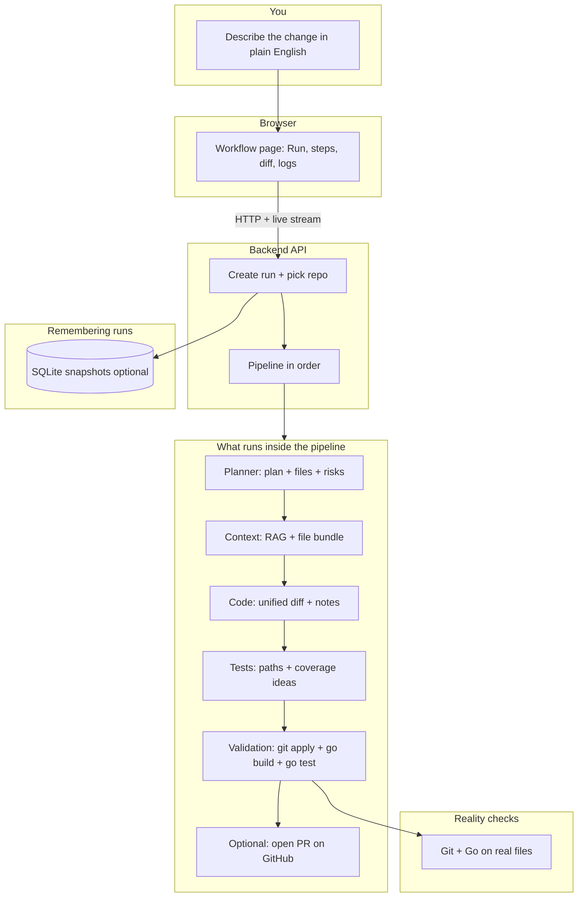

# GoForge

GoForge (repository **goforge**) is an AI-assisted engineering workflow platform. Its first product surface, **PatchFlow**, converts natural-language tickets into validated pull requests for Go monorepos.

The system is designed around **clarity, safety, and reviewability**:
- plan the work first
- generate minimal diff-oriented changes
- generate tests for the changed behavior
- validate with Go toolchain checks before PR creation

---


  
## Vision

PatchFlow (within GoForge) acts as a developer cockpit for ticket-to-PR automation:

`Ticket -> Planner -> Context Retrieval -> Code Agent -> Test Agent -> Validation -> PR`

It is intentionally built with strict stage boundaries and machine-readable contracts to avoid hidden behavior and reduce risk.

### Architecture diagram

High-level flow: you describe the change in the browser; the API creates a run, walks the pipeline in order, validates with **git** and **Go** on real files, and optionally persists run snapshots to SQLite. The editable Mermaid source also lives in `docs/patchflow-system-diagram.mmd`.



---

## Current Scope (Vertical Slice)

PatchFlow runs against either:

- **Local path** — default `GOFORGE_REPO_ROOT` / `./sandbox-repo` (no network required for the default flow), or
- **HTTPS remote** — `POST /api/run` with `{ "task": "...", "repo_url": "https://github.com/org/repo" }` (or the optional URL field on `/workflow`). The server **validates** the host (allowlist + DNS checks) and **clones** into `GOFORGE_CLONE_CACHE_ROOT` (default `backend/data/clones/`), then runs the same pipeline on that tree.
- **Private remotes** — do not put tokens in `repo_url`. Set **`GOFORGE_REMOTE_CLONE_TOKEN`** (any allowed host) and/or **`GOFORGE_GITHUB_TOKEN`** (reused for `github.com` / `*.github.com` clones only). GitHub Enterprise on other domains needs **`GOFORGE_REMOTE_CLONE_TOKEN`**. The backend embeds credentials only for `git` subprocesses and resets `origin` to the credential-free URL afterward.

---

## Tech Stack

### Frontend
- Next.js (App Router)
- React + TypeScript
- Tailwind CSS
- shadcn-style UI components

### Backend (orchestration engine)
- Python + FastAPI — run lifecycle, PatchFlow pipeline, SSE, optional SQLite persistence

### Target codebase
- Go monorepo (modified by generated patches/diffs)

---

## Repository Structure

```text
goforge/
  frontend/         # PatchFlow marketing + UI shell (implemented)
  backend/          # FastAPI orchestration API (PatchFlow pipeline, agents, RAG, validation, optional PR)
  sandbox-repo/     # Local Go repo target for the first vertical slice
```

Backend package layout (current):

```text
goforge/
  backend/goforge/
    agents/         # planner, codegen, test agent
    rag/            # chunk, embed, retrieval
    validation/     # go build / go test
    repo/, github/  # workspace, optional PR
    persistence/    # optional SQLite run store
```

---

## Frontend (Implemented)

The frontend includes:

1. **Marketing site** (`/`) — premium dark-first landing page with:
   - Header (logo, nav, CTAs)
   - Hero section (headline, subheadline, CTAs, product mockup)
   - Trust strip
   - How-it-works section
   - Feature grid
   - Demo preview section
   - Architecture flow section
   - FAQ
   - Final CTA
   - Footer

2. **Live workflow** (`/workflow`) — connects to the FastAPI backend:
   - task input + Run → `POST /api/run`
   - live steps, logs, and unified diff via `GET /api/run/{id}` and SSE `…/stream`

Configure the API URL for the browser:

```bash
# frontend/.env.local (optional; defaults to http://127.0.0.1:8000)
NEXT_PUBLIC_API_URL=http://127.0.0.1:8000
```

The landing mockups reflect the same PatchFlow layout model:
- left: workflow steps/statuses
- center: diff viewer
- right: agent/log stream

---

## Backend (Implemented)

The backend is a FastAPI service that owns run lifecycle and exposes the API contracts the UI will consume.

### What works today
- `POST /api/run` accepts `{ "task": "..." }` for the **local** repo (`GOFORGE_REPO_ROOT`), or `{ "task": "...", "repo_url": "https://..." }` to **clone or refresh** a public HTTPS repo into the cache and run there. Then the **PatchFlow pipeline** runs: **Planner** → **Context Retrieval** (**RAG** when configured) → **Code Generation** (unified diff + **`notes`**) → **Test Generation** (**`tests`** + **`coverage_focus`**) → **Validation** (`git apply` + `go build ./...` + `go test ./...`). **After initializing** a local git baseline in `sandbox-repo` on first use (local mode), each run **resets** to `HEAD` before applying, then **resets** again after the run so the next run starts clean.
- With an API key, **Validation** can **retry** up to `GOFORGE_VALIDATION_MAX_ATTEMPTS` times (default 3) on the same run, feeding the previous failure back into the code agent.
- `GET /api/run/{id}` returns the latest snapshot (steps, logs, diff, **`code_notes`**, **`test_paths`**, **`coverage_focus`**, `pr_url`, errors).
- `GET /api/run/{id}/stream` streams **SSE** snapshots as the pipeline advances.
- `GET /health` reports whether the default local repo path exists, whether **remote clone** is enabled, and whether **`go`** and **`git`** are on `PATH` (with version lines).
- `GET /api/pr/{id}` returns **run status**, **`pr_url`** (if a PR was opened), and **`error`** (if any). PR creation is **optional** (see GitHub below).
- If **`go build ./...`** or **`go test ./...`** fails after retries are exhausted, the run ends in **`failed`** with Validation marked **`failed`** and logs containing the failing output.

### Configuration
- `GOFORGE_REPO_ROOT`: absolute or relative path to the local Go repo (default: repository `sandbox-repo/` next to this README).
- **Remote clone** (optional): `GOFORGE_REMOTE_CLONE_ENABLED` (default `true`), `GOFORGE_CLONE_CACHE_ROOT`, `GOFORGE_CLONE_TIMEOUT_S`, `GOFORGE_REMOTE_ALLOWED_HOSTS` (comma-separated; empty defaults to `github.com`, `gitlab.com`, `bitbucket.org`, `codeberg.org`), `GOFORGE_REMOTE_CLONE_TOKEN` (private repos, any host), and `GOFORGE_GITHUB_TOKEN` (private **GitHub** clones when set).

**Optional LLM** (OpenAI-compatible Chat Completions JSON): when `GOFORGE_OPENAI_API_KEY` is set, **Planner**, **Code Generation**, and **Test Generation** call the API; otherwise the planner uses a deterministic mock plan, codegen uses a fixed sandbox **mock diff** (see `backend/goforge/default_diff.py`), and the test agent uses heuristics from the diff. Planner failures fall back to mock output with a **risk** line; codegen/test failures fall back to mock output with a log line. See `backend/.env.example` for timeouts and models.

**Optional GitHub PR** (after `go build` and `go test` pass): set `GOFORGE_GITHUB_TOKEN` (repo scope) and `GOFORGE_GITHUB_REPO` as `owner/name`. The backend creates a branch, commits, pushes to `https://github.com/owner/name`, and opens a PR via the GitHub API. Leave unset to skip (logs will say so). Set `GOFORGE_GITHUB_DEFAULT_BRANCH` only if auto-detection does not match your default branch (empty = detect `main` vs `master` locally).

### Run locally
```bash
cd backend
python3 -m venv .venv
.venv/bin/pip install -r requirements.txt
.venv/bin/uvicorn goforge.main:app --reload --host 127.0.0.1 --port 8000
```

### Backend tests
```bash
cd backend
.venv/bin/python -m unittest discover -s tests -v
```

### One-shot local verification
From the repository root (after `backend/.venv` exists and `frontend/node_modules` are installed):

```bash
bash scripts/verify-patchflow.sh
```

This runs unit tests, an in-process API smoke check (`backend/scripts/smoke_api.py`), `npm run build` in `frontend/`, and `docker compose config` when Docker is available.

### Manual UI check
In two terminals: `cd backend && .venv/bin/uvicorn goforge.main:app --reload --host 127.0.0.1 --port 8000` and `cd frontend && npm run dev`. Open `http://localhost:3000/workflow`, run a task against the default sandbox repo (optional `repo_url` for remote clones).

### Production notes
- **Run persistence**: snapshots are written to **SQLite** at `GOFORGE_DB_PATH` (default `backend/data/goforge.db`). After a restart, **`GET /api/run/{id}`** still returns completed/failed runs. In-flight runs (`queued` / `running`) are marked **failed** with *Run interrupted by server restart.*
- **Disable persistence** (e.g. tests): `GOFORGE_PERSISTENCE_ENABLED=false`.
- **Health**: `GET /health` includes `persistence`, `database_path`, `openai_key_configured`, `remote_clone_enabled`, and `remote_clone_auth_configured` (whether a server-side clone token / GitHub token is set).
- **Docker**: from the repo root, `docker compose up --build` runs the API with `./sandbox-repo` mounted and a volume for `/data` (see `docker-compose.yml`). Install **Go** inside the image so `go build` / `go test` validation works without relying on the host.

---

## Planned Backend Workflow

### Stage Pipeline
1. Receive task from frontend
2. Create run ID
3. Planner agent produces structured plan
4. Context retrieval gathers relevant Go code
5. Code agent proposes minimal diff
6. Test agent proposes/adds tests
7. Validation runs `go build` and `go test`
8. PR is created only on successful validation

### Core Principles
- strict JSON contracts between stages
- explicit run states (`queued`, `running`, `done`, `failed`)
- visible logs and validation results
- no hidden auto-merge behavior

---

## API (current + planned)

Implemented:
- `POST /api/run` — start run, return run ID
- `GET /api/run/{id}` — run snapshot
- `GET /api/run/{id}/stream` — SSE stream of snapshots
- `GET /health` — repo path probe
- `GET /api/pr/{id}` — run snapshot fields for PR (`pr_url`, `status`, `error`)

---

## Local Development

### Prerequisites
- Node.js 20+
- npm
- Python 3.11+ (for backend)

### Run frontend
```bash
cd frontend
npm install
npm run dev
```

### Quality checks
```bash
cd frontend
npm run lint
npm run build
```

---

## Roadmap

### Phase A (Done)
- frontend layout and storytelling surface
- product mock sections aligned to orchestrator workflow

### Phase B (Done — vertical slice)
- FastAPI API: run lifecycle, SSE, structured snapshots, optional SQLite persistence
- frontend `/workflow` wired to the API

### Phase C (Done — local repo path)
- `./sandbox-repo` Go module + **git apply** + **`go build` / `go test`** + reset between runs
- Planner / codegen / test agent: **LLM path when `GOFORGE_OPENAI_API_KEY` is set**, deterministic mock otherwise
- Validation **retry** loop feeding failures back to codegen
- RAG (chunk + embeddings + top‑k) when key + `GOFORGE_RAG_ENABLED` allow

### Phase D (Done — optional)
- GitHub branch / commit / push / PR when token + repo configured

### Phase E (Ongoing / optional)
- polish, observability, self-hosted forge quirks (nonstandard auth)

---

## Design and Quality Standards

PatchFlow development follows these constraints:
- clean, readable, maintainable code
- clear naming and logical structure
- explicit edge-case handling
- minimal but meaningful comments
- no unnecessary abstractions
- validation-first automation

---

## Notes

- `sandbox-repo/` is a **small real Go module** (see `go.mod` and `internal/greet/`) so `go test ./...` can pass in the Validation stage.
- On first pipeline run, the backend may **`git init`** that directory (ignored by git via `sandbox-repo/.git/` in `.gitignore`) so patches can be applied and reverted safely.
- With **`GOFORGE_OPENAI_API_KEY`**, planner/code/test use the LLM; without it they use deterministic mocks. **Patch apply + go build + go test** are always real against `sandbox-repo`.
